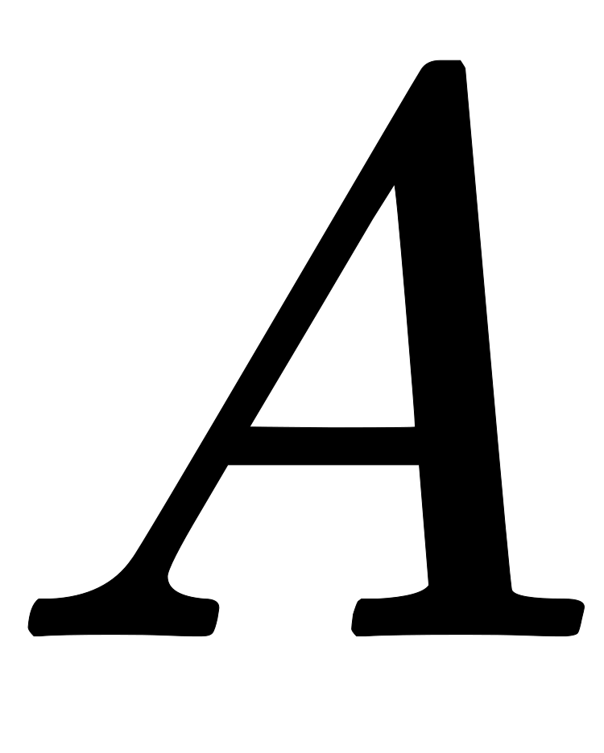
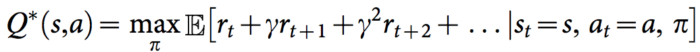

#### Udacity Deep Reinforcement Learning Nanodegree
### Project 1: Navigation
# Train an RL Agent to Collect Bananas

### Introduction

For this project, we have trained an agent to navigate (and collect bananas!) in a large, square world.

A reward of +1 is provided for collecting a yellow banana, and a reward of -1 is provided for collecting a blue banana.  Thus, the goal of our agent is to collect as many yellow bananas as possible while avoiding blue bananas.
##### &nbsp;

## Project
The project is composed of five main steps:

1. State and action space evalaution
2. Benchmark / baseline using a random action policy
3. DQN algorithm implementation
4. Run DQNs algorithm with different parameters

##### &nbsp;

### 1. State and action space evalaution
The state space has 37 dimensions and contains the agent's velocity, along with ray-based perception of objects around agent's forward direction.  Given this information, the agent has to learn how to best select actions.  Four discrete actions are available, corresponding to:
- **`0`** - move forward.
- **`1`** - move backward.
- **`2`** - turn left.
- **`3`** - turn right.

The task is episodic, and in order to solve the environment, our agent must get an average score of +13 over 100 consecutive episodes.
##### &nbsp;

### 2. Benchmark / baseline using a random action policy
Before embarking in builduing a deep reinforcement learning agent, we started by testing an agent that "doesn't learn" but selects actions uniformly at random.

```python
env_info = env.reset(train_mode=False)[brain_name] # reset the environment
state = env_info.vector_observations[0]            # get the current state
score = 0                                          # initialize the score
while True:
    action = np.random.randint(action_size)        # select an action
    env_info = env.step(action)[brain_name]        # send the action to the environment
    next_state = env_info.vector_observations[0]   # get the next state
    reward = env_info.rewards[0]                   # get the reward
    done = env_info.local_done[0]                  # see if episode has finished
    score += reward                                # update the score
    state = next_state                             # roll over the state to next time step
    if done:                                       # exit loop if episode finished
        break

print("Score: {}".format(score))
```

After one run the score is 0.0. Although one run is generally not enough to form an accurate view, in this instance we deem to be sufficient to understand to understand that this methodology won't help us to solve the problem. Hence the need for deeep reinforcement learning.


##### &nbsp;


### 3. DQN Algorithm implementation
In general, reinforcement learning involves an agent, a set of states , and a set  of actions per state. By performing an action {\displaystyle a\in A} a\in A, the agent transitions from state to state. Executing an action in a specific state provides the agent with a reward (a numerical score).
The goal of the agent is to maximize its total (future) reward. It does this by adding the maximum reward attainable from future states to the reward for achieving its current state, effectively influencing the current action by the potential future reward. This potential reward is a weighted sum of the expected values of the rewards of all future steps starting from the current state.

The optimal policy must be discovered by interacting with the environment and recording observations. Therefore, the agent "learns" the policy through a process of trial-and-error that iteratively maps various environment states to the actions that yield the highest reward. This type of algorithm is called **Q-Learning**.

#### Q-Function
The weight for a step from a state {\displaystyle \Delta t} \Delta t steps into the future is calculated as {\displaystyle \gamma ^{\Delta t}} \gamma ^{{\Delta t}}. {\displaystyle \gamma } \gamma  (the discount factor) is a number between 0 and 1 ( {\displaystyle 0\leq \gamma \leq 1} 0\leq \gamma \leq 1) and has the effect of valuing rewards received earlier higher than those received later (reflecting the value of a "good start"). {\displaystyle \gamma } \gamma  may also be interpreted as the probability to succeed (or survive) at every step {\displaystyle \Delta t} \Delta t.

In order to discount returns at future time steps, the Q-function can be expanded to include the hyperparameter gamma `γ`.



The algorithm, therefore, has a function that calculates the quality of a state-action combination:

{\displaystyle Q:S\times A\to \mathbb {R} } Q:S\times A\to {\mathbb  {R}} .
Before learning begins, {\displaystyle Q} Q is initialized to a possibly arbitrary fixed value (chosen by the programmer). Then, at each time {\displaystyle t} t the agent selects an action {\displaystyle a_{t}} a_{t}, observes a reward {\displaystyle r_{t}} r_{t}, enters a new state {\displaystyle s_{t+1}} s_{t+1} (that may depend on both the previous state {\displaystyle s_{t}} s_{t} and the selected action), and {\displaystyle Q} Q is updated. The core of the algorithm is a simple value iteration update, using the weighted average of the old value and the new information:

{\displaystyle Q^{new}(s_{t},a_{t})\leftarrow (1-\alpha )\cdot \underbrace {Q(s_{t},a_{t})} _{\text{old value}}+\underbrace {\alpha } _{\text{learning rate}}\cdot \overbrace {{\bigg (}\underbrace {r_{t}} _{\text{reward}}+\underbrace {\gamma } _{\text{discount factor}}\cdot \underbrace {\max _{a}Q(s_{t+1},a)} _{\text{estimate of optimal future value}}{\bigg )}} ^{\text{learned value}}}

where {\displaystyle r_{t}} {\displaystyle r_{t}} is the reward received when moving from the state {\displaystyle s_{t}} s_{{t}} to the state {\displaystyle s_{t+1}} s_{t+1}, and {\displaystyle \alpha } \alpha  is the learning rate ( {\displaystyle 0<\alpha \leq 1} 0<\alpha \leq 1).

We can then define our optimal policy `π*` as the action that maximizes the Q-function for a given state across all possible states. The optimal Q-function `Q*(s,a)` maximizes the total expected reward for an agent starting in state `s` and choosing action `a`, then following the optimal policy for each subsequent state.


#### Epsilon Greedy Algorithm
The **exploration vs. exploitation dilemma** is a well known challenge in the field of reinforcement learning and it refers to the challenge with the Q-function in choosing which action to take while the agent is still learning the optimal policy. Should the agent choose an action based on the Q-values observed thus far? Or, should the agent try a new action in hopes of earning a higher reward?

We implemented an **𝛆-greedy algorithm** to systematically manage the exploration vs. exploitation trade-off. The agent "explores" by picking a random action with some probability epsilon `𝛜`. However, the agent continues to "exploit" its knowledge of the environment by choosing actions based on the policy with probability (1-𝛜).

Furthermore, the value of epsilon is purposely decayed over time, so that the agent favors exploration during its initial interactions with the environment, but increasingly favors exploitation as it gains more experience. The starting and ending values for epsilon, and the rate at which it decays are three hyperparameters that are later tuned during experimentation.

You can find the 𝛆-greedy logic implemented as part of the `agent.act()` method in `agent.py` of the source code.


#### Deep Q-Network (DQN)
As name suggest, Deep Q-Learning, could essentially be described as a combination of a deep neural network and reinforcement learning. In this instance a deep network is used to approximate the Q-function. Given a network `F`, finding an optimal policy is a matter of finding the best weights `w` such that `F(s,a,w) ≈ Q(s,a)`.

The neural network architecture used for this project can be found in the `model.py` file of the source code. The network contains three fully connected layers with 64, 64, and 4 nodes respectively.

#### Experience Replay
Experience replay allows the RL agent to learn from past experience.

Each experience is stored in a replay buffer as the agent interacts with the environment. The replay buffer contains a collection of experience tuples with the state, action, reward, and next state `(s, a, r, s')`. The agent then samples from this buffer as part of the learning step. Experiences are sampled randomly, so that the data is uncorrelated. This prevents action values from oscillating or diverging catastrophically, since a naive Q-learning algorithm could otherwise become biased by correlations between sequential experience tuples.

Also, experience replay improves learning through repetition. By doing multiple passes over the data, our agent has multiple opportunities to learn from a single experience tuple. This is particularly useful for state-action pairs that occur infrequently within the environment.

The implementation of the replay buffer can be found in the `agent.py` file of the source code.

##### &nbsp;

### 4. Run Experiments

Given that implementing DQN respect to initial benchmark policy was quite successful we only lmited ourselves to different hyperparameters. We managed in more than one occasion to solve in less than 250 episodes.


##### &nbsp;


---

# Project Starter Code
The project starter code can be found below, in case you want to run this project yourself.

Also, the original Udacity repo for this project can be found [here](https://github.com/udacity/deep-reinforcement-learning/tree/master/p1_navigation).


### Getting Started

1. Download the environment from one of the links below.  You need only select the environment that matches your operating system:
    - Linux: [click here](https://s3-us-west-1.amazonaws.com/udacity-drlnd/P1/Banana/Banana_Linux.zip)
    - Mac OSX: [click here](https://s3-us-west-1.amazonaws.com/udacity-drlnd/P1/Banana/Banana.app.zip)
    - Windows (32-bit): [click here](https://s3-us-west-1.amazonaws.com/udacity-drlnd/P1/Banana/Banana_Windows_x86.zip)
    - Windows (64-bit): [click here](https://s3-us-west-1.amazonaws.com/udacity-drlnd/P1/Banana/Banana_Windows_x86_64.zip)

    (_For Windows users_) Check out [this link](https://support.microsoft.com/en-us/help/827218/how-to-determine-whether-a-computer-is-running-a-32-bit-version-or-64) if you need help with determining if your computer is running a 32-bit version or 64-bit version of the Windows operating system.

    (_For AWS_) If you'd like to train the agent on AWS (and have not [enabled a virtual screen](https://github.com/Unity-Technologies/ml-agents/blob/master/docs/Training-on-Amazon-Web-Service.md)), then please use [this link](https://s3-us-west-1.amazonaws.com/udacity-drlnd/P1/Banana/Banana_Linux_NoVis.zip) to obtain the environment.

2. Place the file in the DRLND GitHub repository, in the `p1_navigation/` folder, and unzip (or decompress) the file.

### Instructions

Follow the instructions in `Navigation.ipynb` to get started with training your own agent!


